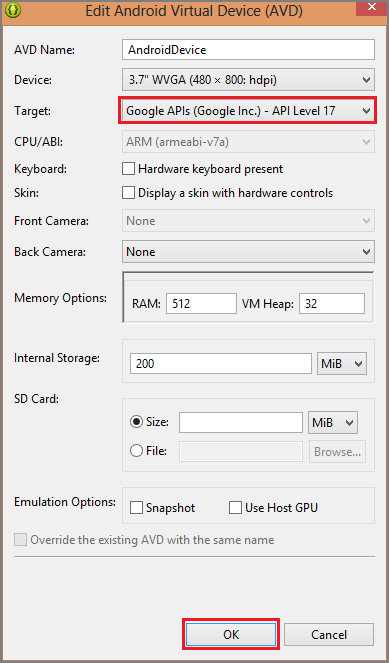

# Windows Azure Mobile Services

### The Challenge

Yes, it's Android on Windows Azure.

In this challenge, you will use Windows Azure Mobile Services to build a connected and sclable Android app in Java.  <b>Once you complete the challenge, swing by the Windows Azure booth to pick up your t-shirt and enter into a raffle for a Jawbone Big Jambox.</b>

You'll login to the Windows Azure portal, create a new Mobile Service and SQL database.  Then, you'll download the sample ToDo list app and have some fun storing data in the cloud, configuring Facebook authentication, and sending push notifications.

The walkthrough below should help you with the challenge, but you can also get in touch with @ChrisRisner, @MH415, or @MLunes90 via Twitter with any questions--we're on site and happy to help!

####Bonus Challenge
For bonus points--send an SMS using Twilio from scheduled scripts. Completing the bonus challenge will get you another entry in the Jambox raffle.

###Validation…and Prizes!

You can get these challenges validated by Chris, Matt, or Miranda until the end of the conference.  Everyone who completes the challenge earns the Mobile Services t-shirt below and one entry in the raffle for a Jawbone Big Jambox.  Those who complete the bonus challenge earn two entries in the Jambox raffle.


### Challenge Walkthrough

####Data

* Either sign up for the [30-day free trial](http://www.windowsazure.com/en-us/pricing/free-trial/?WT.mc_id=azurebg_us_pmm_mirluna_sfadc) and login to the management portal or [login to your existing Windows Azure account](http://www.windowsazure.com/en-us/develop/mobile/android/?WT.mc_id=azurebg_us_pmm_mirluna_sfadc).  

* Click New --> Compute --> Mobile Service --> Create.  Then specify URL and database login/password order to create a new Mobile Service and the associated SQL database.


* Select your new mobile service, choose Android, and click 'Create a New Android app.'


* If you already have the Android Development Tools installed, click 'Create ToDoItem Table' and download the sample app.  This will automatically create a table called 'ToDoItem' in your app's SQL database and connect your sample client app to that table.


* Open the sample app in Eclipse and run the app.  In the simulator, you'll be able to add items to the Todo list.  Add a few items like 'Head to Chris Risner's session' and 'Complete the Mobile Services challenge.' When you hit the (+) button, you're sending a POST your app's Mobile Services backend hosted in Windows Azure.


* If you head back to the [Windows Azure Portal](manage.windowsazure.com), you'll see that items that you added to the list are now stored in the TodoItem table in your SQL database.


* When you drill down into the 'TodoItem' table under the 'DATA' tab in the portal, you'll see the items you entered in a table with three columns.  Next, we're going to click the script table and copy the following code snippet into the 'Insert' operation to see how dynamic schemas work in Mobile Services.


Scripts are how you add some custom logic to your app, connect to other Windows Azure services, or work with third party APIs.  With Mobile Services, all your server scripts need to be written in JavaScript.

```
function insert(item, user, request) {

    item.created = new Date();

    request.execute();

}
```

* Head back to the simulator and add another item--like 'Testing Dynamic Schema' and hit the (+) button.  Now, if you refresh the table in the Windows Azure portal, you will see a fourth column added that details when the item was created.


* Enabling dynamic schema is great when you want to create the schema for your table but you don't want to let all your users alter it in production.  To turn off dynamic schema, head to the configure tab and select 'OFF' for dynamic schema.


* Here, we've walked through using a SQL database with your Mobile Service, but some apps need to store unstructured binary or typed data. Using scripts, you could easily connect to Windows Azure Blob or Table Storage (as well as many other third party data options). 

####User Authentication

* The next step is to get set up with Facebook authentication and limit access to authenticated users.  

* In the Management Portal, click the Data tab, and then click the TodoItem table.


* Click the Permissions tab, set all permissions to 'Only Authenticated Users,' and then click Save. This will ensure that all operations against the TodoItem table require an authenticated user. This also simplifies the scripts in the next tutorial because they will not have to allow for the possibility of anonymous users.


* Follow the steps on [this page](http://www.windowsazure.com/en-us/develop/mobile/how-to-guides/register-for-facebook-authentication/) to register your app for Facebook authentication with Mobile Services.

* Copy over your App Key and Secret from Facebook into the appropriate slots in the 'IDENTITY' tab. Hit 'Save.'


* Back in Eclipse, open the ToDoActivity.java file and add the following import statements:

```
import com.microsoft.windowsazure.mobileservices.MobileServiceUser;
import com.microsoft.windowsazure.mobileservices.MobileServiceAuthenticationProvider;
import com.microsoft.windowsazure.mobileservices.UserAuthenticationCallback;
```

* Add the following method to the ToDoActivity Class:

```
private void authenticate() {


// Login using the Facebook provider.
mClient.login(MobileServiceAuthenticationProvider.Facebook,
        new UserAuthenticationCallback() {


            @Override
            public void onCompleted(MobileServiceUser user,
                    Exception exception, ServiceFilterResponse response) {


                if (exception == null) {
                    createAndShowDialog(String.format(
                                    "You are now logged in - %1$2s",
                                    user.getUserId()), "Success");
                    createTable();
                } else {
                    createAndShowDialog("You must log in. Login Required", "Error");
                }
            }
        });


}

```

* In the OnCreate method,add the folliwng line of code that instantiates teh MobileServicesClient object.

```
authenticate();
```
* Move the code that's after authenticate(); in the OnCreate method to a new createTable method:

```
private void createTable() {


// Get the Mobile Service Table instance to use
mToDoTable = mClient.getTable(ToDoItem.class);


mTextNewToDo = (EditText) findViewById(R.id.textNewToDo);


// Create an adapter to bind the items with the view
mAdapter = new ToDoItemAdapter(this, R.layout.row_list_to_do);
ListView listViewToDo = (ListView) findViewById(R.id.listViewToDo);
listViewToDo.setAdapter(mAdapter);


// Load the items from the Mobile Service
refreshItemsFromTable();


}
```

* Click Run to start the app and login with Facebook.  Once you've logged in, the app will run without errors and you will be able to query Mobily Services and make updates to data.

####Push Notifications

* To get started with push notifications, head to the 'PUSH' tab, copy the API key you receive from Google Cloud Messaging (GCM) and hit 'Save.' (More details on getting an API key for your Android app can be found [here](https://www.windowsazure.com/en-us/develop/mobile/tutorials/get-started-with-push-android/).)


* If you haven't added the Google Cloud Messaging for Android Library, follow the steps on [this page](https://www.windowsazure.com/en-us/develop/mobile/tutorials/get-started-with-push-android/) under 'Add Push Notifications.'

* To create a new property that holds the registration ID, open the file ToDoItem.java, add the following code to the TodoItem class

```
@com.google.gson.annotations.SerializedName("channel")
private String mRegistrationId;


public String getRegistrationId() {
    return mRegistrationId;
}


public final void getRegistrationId(String registrationId) {
    mRegistrationId = registrationId;
}
```
When dynamic schema is enabled on your mobile service, a new 'channel' column is automatically added to the TodoItem table when a new item that contains this property is inserted.  You should head back to the 'Configure' tab in the Windows Azure portal and flip dynamic schema back on.  Don't forget to hit 'Save.'

* Open the file ToDoItemActivity.java, and add the following import statement:

```
import com.google.android.gcm.GCMRegistrar;
```
* Add the following private variables to the class, where <PROJECT_ID> is the project ID assigned by Google to your app in the first procedure:

```
private String mRegistationId;
public static final String SENDER_ID = "<PROJECT_ID>";
```

* To get the registration ID for the device, find the onCreate method and add this code before the MobileServiceClient is instantiated:

```
GCMRegistrar.checkDevice(this);
GCMRegistrar.checkManifest(this);
mRegistationId = GCMRegistrar.getRegistrationId(this);
if (mRegistationId.equals("")) {
    GCMRegistrar.register(this, SENDER_ID);
}
```

* Set the registrationID property of the item to the registration ID of the device by adding the following line of code to the addItem method:

```
item.setRegistrationId(mRegistationId);
```

* In the Package Explorer, right-click the package (under the src node), then click New --> Class.  In 'Name' type GCMInstentService.  In Superclass type com.google.android.cgm.GCMBaseIntentService.  Then hit Finish.  That will create the new GCMIntentService class.


* Add the following import statements:

```
import android.app.NotificationManager;
import android.support.v4.app.NotificationCompat;
```

* Add the following constructor to the new class in order to invoke the Superclass constructor with teh app SENDER_ID value of the app:

```
public GCMIntentService(){
super(ToDoActivity.SENDER_ID);
}
```

* Replace the existing onMessage method override with the following code:

```
@Override
protected void onMessage(Context context, Intent intent) {


NotificationCompat.Builder mBuilder =
        new NotificationCompat.Builder(this)
            .setSmallIcon(R.drawable.ic_launcher)
            .setContentTitle("New todo item!")
            .setPriority(Notification.PRIORITY_HIGH)
            .setContentText(intent.getStringExtra("message"));
NotificationManager mNotificationManager =
    (NotificationManager) getSystemService(Context.NOTIFICATION_SERVICE);
mNotificationManager.notify(0, mBuilder.build());


}
```
(Note that here we're only overriding OnMessage.  In a real-world app you'd want to implement all four method overrides.)

* Back in the management portal, click the Data tab and then click the TodoItem table.

*Click the 'SCRIPT' tab and be sure 'Insert' is selected.

*Replace the preopopulated text with the following:

```
function insert(item, user, request) {
    request.execute({
        success: function() {
            // Write to the response and then send the notification in the background
            request.respond();
            push.gcm.send(item.channel, item.text, {
                success: function(response) {
                    console.log(‘Push notification sent: ’, response);
                }, error: function(error) {
                    console.log(‘Error sending push notification: ’, error);
                }
            });
        }
    });
}
```

This registers a new insert script, which uses the gcm object to send a push notification with the inserted text to the device provided in the insert request.

*Restart Eclipse, then in Package Explorer, right-click the project, click Properties, click Android, check Google APIs, then click OK.


*Select Google APIs in Target, then click OK.

*From Window, select Android Virtual Device Manager, select your device, click Edit.



*From the Run menu, click Run to start the app.  If you type another todo item, then click add, you'll see an icon appear in the top left of the screen. If you click on that, the notification will display.

*Congratulations on getting up and running with Mobile Services for Android!! Either continue on to the Bonus Challenge or pick up your t-shirt at the Windows Azure booth.

#####Bonus Challenge #1 Walkthrough

* The Windows Azure Store contains services and data sets that can be useful in your app.  New Relic offers a comprehensive developer analytics and application perfomance monitoring solution. 

* Click New --> Store --> New Relic --> Free and then follow the wizard.

* After you have signed-up for the New Relic service, you need to install the New Relic Node.js module in your mobile service. You must have source control enabled for your mobile service to be able to upload this module. (To store server scripts in source control, follow [this guide](https://www.windowsazure.com/en-us/develop/mobile/tutorials/store-scripts-in-source-control/). Be sure you also have [npm installed](http://nodejs.org/).)

* Navigate to the .\service folder of your local Git repo and run 

```
npm install newrelic
```

* Open your git command-line tool and type the following commmand to upload the newrelic module to your mobile service.

```
$ git add .
$ git commit –m "added newrelic module"
$ git push origin master
```

* Head to the 'Configure' tab in the management portal and scroll down to 'developer analytics,' seclect 'Add-On' and hit 'Save.'


* Once you run your client app and generate a few read, create, update, and delete requests to your mobile service.  Then, go to 'Add-Ons in the left nav of the portal, select New Relic and hit 'Manage' at the bottom.

* Click 'Applications' and then your mobile service.


* Click 'Web transactions' to see all the requests you've made to your mobile service.


###Resources:

* Android Getting Started Content: www.windowsazure.com/Android
* Mobile Dev Center: www.windowsazure.com/mobile
* Collection of helpful blog posts & tutorials: aka.ms/CommonWAMS
* Forum: http://social.msdn.microsoft.com/Forums/en-US/azuremobile/threads
* Feature Requests: mobileservices.uservoice.com
* Feedback: mobileservices (at) microsoft (dot) com
